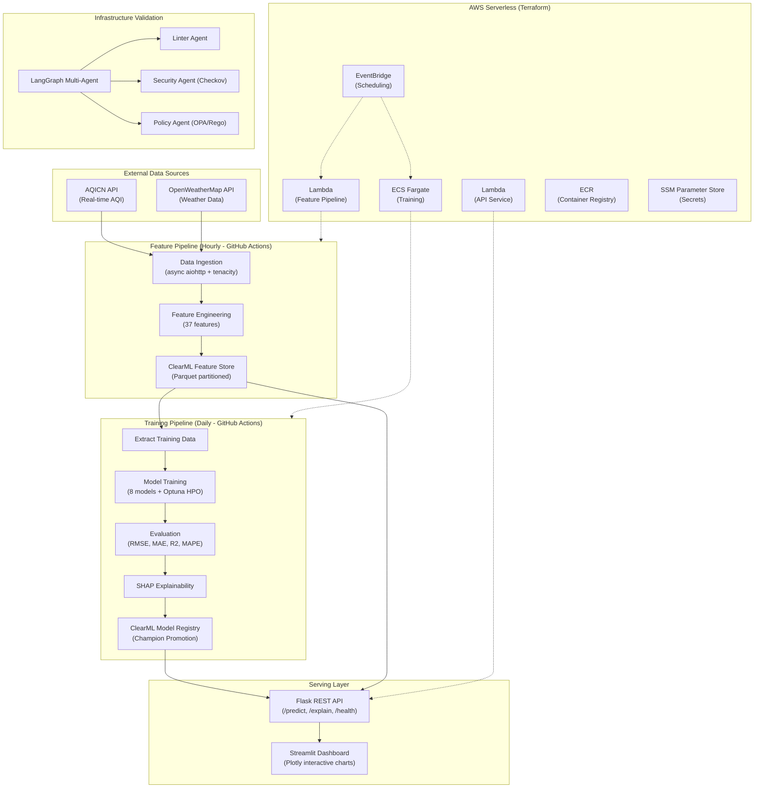
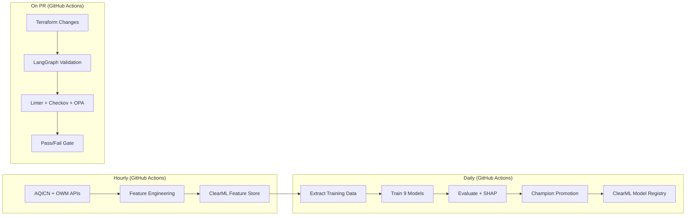
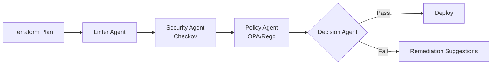

<div align="center">

# Pearls AQI Predictor

**End-to-end Air Quality Index forecasting system for Sargodha, Pakistan**

Predicting AQI 72 hours (3 days) into the future using a serverless ML pipeline

[](https://www.python.org/downloads/release/python-3110/)
[](https://flask.palletsprojects.com)
[](https://pytorch.org)
[](https://streamlit.io)
[](https://clear.ml)
[](https://www.docker.com/)
[](https://aws.amazon.com/)
[](https://www.terraform.io/)

[Live Demo](https://huggingface.co/spaces/Zain-773/AQI-Predictor)

</div>

---

## Overview

Pearls AQI Predictor is a production-ready, end-to-end machine learning system that forecasts Air Quality Index (AQI) **72 hours (3 days)** into the future for Sargodha, Pakistan (32.08N, 72.67E). The system features:

- **8 ML models** spanning linear, ensemble, gradient boosting, and deep learning approaches
- **Automated pipelines** for hourly data ingestion and daily model retraining
- **ClearML** as the Feature Store and experiment tracking platform
- **SHAP-based explainability** with Temporal Grad-CAM for deep learning models
- **Serverless AWS deployment** via Terraform infrastructure-as-code
- **Interactive dashboards** with Streamlit + Flask API backend

Built for the **Pearls Engineering Program** to demonstrate full-stack MLOps proficiency.

---

## System Architecture



---

## Key Features

| Category | Details |
|----------|---------|
| **Multi-Model Zoo** | 9 models: Ridge, ElasticNet, Random Forest, Extra Trees, Gradient Boosting, SVR, LightGBM (Optuna), XGBoost (Optuna), Bi-LSTM + Multi-Head Attention |
| **Feature Store** | ClearML Dataset versioning with local Parquet (Hive-partitioned by year/month) |
| **Experiment Tracking** | ClearML for model registry, metrics logging, and artifact management |
| **Explainability** | SHAP TreeExplainer + GradientExplainer + Temporal Grad-CAM for LSTM |
| **Drift Detection** | Population Stability Index (PSI) monitoring across all features |
| **Anomaly Detection** | Isolation Forest for outlier identification in incoming data |
| **Health Advisories** | AQI-based alerts with context-aware recommendations |
| **Infrastructure Validation** | LangGraph multi-agent pipeline (Linter, Checkov, OPA/Rego) |
| **CI/CD** | GitHub Actions (hourly ingestion + daily training) + AWS CodePipeline |
| **Serverless Deployment** | AWS Lambda (API) + ECS Fargate (training) + EventBridge (scheduling) |

---

## Tech Stack

| Layer | Technologies |
|-------|-------------|
| **API Backend** | Python 3.11, Flask 3.0+, flask-cors |
| **Dashboard** | Streamlit 1.30+, Plotly 5.15+ |
| **ML/DL** | scikit-learn, LightGBM, XGBoost, PyTorch 2.2+, Optuna |
| **Feature Store** | ClearML 1.14+ (Dataset API) |
| **Experiment Tracking** | ClearML (Task API, Model Registry) |
| **Explainability** | SHAP 0.42+, Custom Temporal Grad-CAM |
| **Data Engineering** | Pandas, NumPy, SciPy, aiohttp, tenacity |
| **Infrastructure** | Terraform, Docker, AWS (Lambda, ECS, ECR, EventBridge, SSM) |
| **Validation** | LangGraph, LangChain, OPA/Rego, Checkov |
| **CI/CD** | GitHub Actions, AWS CodePipeline/CodeBuild |
| **Configuration** | Pydantic v2, pydantic-settings, python-dotenv |
| **Testing** | pytest, pytest-asyncio, httpx |

---

## Quick Start

### Prerequisites

- Python 3.11+
- Docker (optional)
- API keys: [AQICN](https://aqicn.org/data-platform/token/) and [OpenWeatherMap](https://openweathermap.org/api)
- ClearML account (free tier): [app.clear.ml](https://app.clear.ml)

### Installation

```bash
git clone https://github.com/Zain-ul-abdeen-773/AQI-Predictor.git
cd AQI-Predictor

python -m venv venv
source venv/bin/activate  # Linux/Mac
venv\Scripts\activate     # Windows

pip install -r requirements.txt
```

### Environment Configuration

```bash
cp .env.example .env
```

Edit `.env` with your credentials:

```env
AQICN_API_KEY=your_aqicn_token
OPENWEATHER_API_KEY=your_openweather_key
CLEARML_API_ACCESS_KEY=your_clearml_key
CLEARML_API_SECRET_KEY=your_clearml_secret
```

### Generate Training Data

```bash
python -m data_pipeline.backfill --years 5
```

### Train Models

```bash
# Train all models
python -m training_pipeline.train

# Train from CSV directly
python -m training_pipeline.train --csv
```

### Launch Application

```bash
# Start Flask API
flask --app deployment.api.main:app run --port 8000

# Start Streamlit dashboard (separate terminal)
streamlit run deployment/streamlit_app/app.py
```

### Docker Deployment

```bash
docker-compose up --build
```

---

## Project Structure

```
.
├── config/                         # Application configuration
│   ├── settings.py                 #   Pydantic BaseSettings (all env vars + hyperparams)
│   └── schemas.py                  #   Pydantic validation schemas (467 lines)
│
├── eda/                            # Exploratory Data Analysis
│   ├── run_eda.py                  #   10-stage EDA pipeline (reproducible)
│   ├── plots/                      #   10 PNG visualizations
│   └── reports/                    #   18 CSV/JSON statistical reports
│
├── data_pipeline/                  # Data ingestion & feature engineering
│   ├── ingest.py                   #   Async AQICN + OpenWeather client (aiohttp + tenacity)
│   ├── backfill.py                 #   5-year historical data generation
│   └── transformers.py             #   37-feature engineering (temporal, lag, rolling, interactions)
│
├── feature_pipeline/               # Feature store management
│   └── register.py                 #   ClearML Dataset + local Parquet store
│
├── training_pipeline/              # Model training & evaluation
│   ├── train.py                    #   Training orchestrator (9 models)
│   ├── evaluation.py               #   Metrics + PSI drift + Isolation Forest anomaly
│   ├── explainability.py           #   SHAP TreeExplainer + GradientExplainer
│   ├── registry.py                 #   ClearML model versioning & champion promotion
│   └── models/
│       ├── baseline.py             #     Ridge / ElasticNet
│       ├── ensemble_trees.py       #     RF, ExtraTrees, GBR, SVR
│       ├── tree_ensemble.py        #     LightGBM + Optuna (50 trials)
│       ├── xgboost_model.py        #     XGBoost + Optuna (50 trials)
│       ├── deep_learning.py        #     Bi-LSTM + Multi-Head Attention (PyTorch)
│       ├── grad_cam.py             #     Temporal Grad-CAM explainability
│       └── callbacks.py            #     EarlyStopping, Checkpointing, LR scheduling
│
├── deployment/                     # Serving layer
│   ├── api/
│   │   ├── main.py                 #     Flask REST API (5 endpoints)
│   │   └── dependencies.py         #     Model/feature service loading
│   └── streamlit_app/
│       └── app.py                  #     Interactive Streamlit dashboard (Plotly)
│
├── infrastructure/                 # Cloud infrastructure
│   ├── terraform/                  #   AWS IaC (Lambda, ECS, ECR, EventBridge, SSM)
│   │   ├── main.tf                 #     Core resources
│   │   ├── pipeline.tf             #     CodePipeline/CodeBuild
│   │   ├── provider.tf             #     AWS provider
│   │   ├── variables.tf            #     Input variables
│   │   └── outputs.tf              #     Output values
│   └── validation_agents/          #   LangGraph multi-agent validation
│       ├── validate.py             #     Orchestrator (Linter → Security → Policy → Decision)
│       ├── agents/                 #     4 specialized agents
│       └── policies/               #     OPA Rego compliance rules
│
├── data/                           # Data storage
│   ├── feature_store/              #   Hive-partitioned Parquet (year=YYYY/month=M/)
│   └── backfill_features.csv       #   43,801 rows historical features
│
├── models/                         # Trained model artifacts
│   ├── training_report.json        #   Model comparison report
│   └── sargodha_aqi_forecast_model/
│       └── <timestamp>/            #   model.pkl, metadata.json, metrics.json, params.json
│
├── tests/                          # pytest test suite
│   ├── test_api.py
│   ├── test_data_pipeline.py
│   ├── test_feature_pipeline.py
│   ├── test_training_pipeline.py
│   └── test_validation.py
│
├── .github/workflows/              # CI/CD automation
│   ├── feature_pipeline_cron.yml   #   Hourly: ingest → transform → ClearML push
│   ├── training_pipeline_cron.yml  #   Daily 2AM: train → evaluate → registry
│   └── infra_validation.yml        #   On PR: LangGraph validation
│
├── Dockerfile                      # Multi-stage Python 3.11 build
├── docker-compose.yml              # Container orchestration
├── requirements.txt                # Python dependencies
└── pyproject.toml                  # Project metadata & tool config
```

---

## Models

### Model Zoo

| Model | Type | HPO | Description |
|-------|------|-----|-------------|
| Ridge Regression | Linear | Grid | L2-regularized with RobustScaler |
| ElasticNet | Linear | Grid | L1+L2 combined regularization |
| Random Forest | Ensemble | Default | Bagged decision trees |
| Extra Trees | Ensemble | Default | Extremely randomized trees |
| Gradient Boosting | Ensemble | Default | Sequential boosting |
| SVR | Kernel | Default | RBF kernel support vectors |
| LightGBM | GBDT | Optuna (50 trials) | Leaf-wise growth, TimeSeriesSplit CV |
| XGBoost | GBDT | Optuna (50 trials) | Level-wise growth, TimeSeriesSplit CV |
| Bi-LSTM + Attention | Deep Learning | Callbacks | Bidirectional LSTM + Multi-Head Self-Attention (PyTorch) |

### Current Performance

| Model | RMSE | MAE | R-squared | MAPE |
|-------|------|-----|-----------|------|
| **Ridge (Champion)** | **5.77** | **4.50** | **0.903** | **9.23%** |
| ElasticNet | 6.59 | 4.50 | 0.874 | 9.37% |
| Random Forest | 7.58 | 5.18 | 0.833 | 10.33% |
| Extra Trees | 7.37 | 5.24 | 0.843 | 10.45% |
| Gradient Boosting | 8.10 | 6.30 | 0.810 | 13.89% |

The training pipeline automatically evaluates all models and promotes the best performer (lowest RMSE) as the **champion model**. Champion selection is logged in ClearML.

---

## Feature Engineering

The system engineers **37 features** from raw pollutant and weather data:

| Feature Group | Features | Description |
|---------------|----------|-------------|
| **Cyclical Temporal** | `hour_sin/cos`, `day_sin/cos`, `month_sin/cos` | Preserves periodicity without discontinuities |
| **AQI Change Rate** | `aqi_change_1h`, `aqi_change_3h`, `aqi_change_6h` | Rate of change at multiple horizons |
| **Wind-Pollutant** | `wind_u_pm25`, `wind_v_pm25`, `wind_u_pm10`, `wind_v_pm10` | Vector decomposition x pollutant interaction |
| **Atmospheric** | `temp_humidity_index`, `thermal_inversion_flag` | Boundary layer and inversion detection |
| **Lag Features** | `aqi_lag_6h`, `aqi_lag_12h`, `aqi_lag_24h` | Autoregressive inputs (leakage-safe) |
| **Rolling Stats** | `pm25_rolling_mean_6h`, `pm25_rolling_std_6h`, `pm25_rolling_mean_24h` | Short/long-term statistical trends |
| **Pollution Index** | `pollution_intensity` | Composite normalized pollutant score |

> **Leakage Prevention**: Short-horizon lags (1h, 3h) are excluded from training features to prevent information leakage in the 72-hour forecasting context.

---

## Exploratory Data Analysis

Comprehensive EDA on **43,801 hourly observations** spanning **5 years** (2021-2026). Reproduce with: `python -m eda.run_eda`

### Dataset Summary

| Metric | Value |
|--------|-------|
| Total Observations | 43,801 (hourly) |
| Time Span | 2021-07-16 to 2026-07-15 |
| Engineered Features | 47 columns |
| Missing Values | 0 (0.0%) |
| Mean AQI | 120.0 |
| Max AQI Recorded | 279.7 |
| Hazardous Hours (AQI > 150) | 16,085 (36.72%) |

### AQI Category Distribution


Over a third of all hours fall in unhealthy or worse categories, highlighting the need for accurate forecasting.

### Pollutant Distributions


Non-Gaussian distributions with heavy right tails across all pollutants. D'Agostino-Pearson normality tests confirm non-normality (p < 0.001), justifying ensemble and non-parametric model selection.

### Correlation Analysis


| Feature | Correlation with AQI |
|---------|---------------------|
| CO | 0.980 |
| PM10 | 0.963 |
| NO2 | 0.951 |
| SO2 | 0.951 |
| O3 | -0.947 |


### Temporal Patterns


- **Diurnal**: AQI peaks overnight (boundary layer collapse) and improves midday (convective mixing)
- **Weekly**: Slight weekday/weekend variation from traffic patterns
- **Seasonal**: Strong winter peaks from thermal inversions and biomass burning
- **Yearly**: Slight upward trend over the 5-year period

### Monthly Time Series


### Seasonal Decomposition


**Stationarity (ADF Test):**
- ADF Statistic: -2.12 (critical 5%: -2.86)
- p-value: 0.237 -- series is **non-stationary**
- Implication: Autoregressive features (lags, rolling stats) are essential

### Weather Impact on Air Quality


**Hazardous conditions profile** (AQI > 150):
- Average temperature: 15.3 C (cooler months, inversions)
- Average humidity: 57.8%
- Average wind speed: 0.8 m/s (near-calm, poor dispersion)

### Feature Importance (Mutual Information)


Top predictive features: `aqi_lag_1h`, `pollution_intensity`, `co`, `pm10`, `so2`

### Outlier Analysis


### Key EDA Insights

1. **Non-Gaussian distributions** across all pollutants justify ensemble/tree-based models
2. **Strong multicollinearity** (r > 0.95) handled by Ridge/ElasticNet regularization
3. **Clear seasonality** with winter peaks from thermal inversions and low wind speeds
4. **Non-stationary series** requires lag features and rolling statistics
5. **36.7% hazardous hours** demonstrate the critical need for AQI forecasting in Sargodha

> All EDA artifacts: `eda/plots/` (10 PNG) and `eda/reports/` (18 CSV/JSON)

---

## API Reference

### Flask REST API Endpoints

| Method | Endpoint | Description |
|--------|----------|-------------|
| `GET` | `/health` | Service health check and readiness |
| `POST` | `/predict` | 72-hour AQI forecast with confidence intervals |
| `POST` | `/explain` | SHAP feature contribution analysis |
| `GET` | `/historical` | Historical AQI data for charting |
| `GET` | `/models` | List available models with metrics |

### Example Usage

```bash
# Health check
curl http://localhost:8000/health

# 72-hour forecast (champion model)
curl -X POST http://localhost:8000/predict

# Forecast with specific model
curl -X POST "http://localhost:8000/predict?model_id=ridge"

# SHAP explanations
curl -X POST http://localhost:8000/explain

# Historical data
curl "http://localhost:8000/historical?hours=168"
```

### Response Format (`/predict`)

```json
{
  "model_id": "ridge",
  "forecast_hours": 72,
  "predictions": [
    {"hour": 1, "aqi": 142.5, "category": "Unhealthy for Sensitive Groups"},
    {"hour": 2, "aqi": 145.1, "category": "Unhealthy for Sensitive Groups"}
  ],
  "confidence_intervals": {
    "80_pct": {"lower": [...], "upper": [...]},
    "95_pct": {"lower": [...], "upper": [...]}
  },
  "health_advisory": "Sensitive groups should reduce prolonged outdoor exertion."
}
```

---

## Streamlit Dashboard

The interactive dashboard connects to the Flask API and provides:

- **72-Hour Forecast Chart** -- Plotly interactive line chart with 95% confidence bands
- **Model Selector** -- Switch between trained models in real time
- **Health Advisories** -- Color-coded alerts based on predicted AQI severity
- **AQI Threshold Markers** -- Visual reference lines for EPA categories

```bash
streamlit run deployment/streamlit_app/app.py
```

---

## CI/CD Pipelines

### GitHub Actions (Automated)

| Workflow | Schedule | Purpose |
|----------|----------|---------|
| `feature_pipeline_cron.yml` | Every hour | Ingest data from APIs, engineer features, push to ClearML |
| `training_pipeline_cron.yml` | Daily at 02:00 UTC | Train models, evaluate, promote champion to ClearML registry |
| `infra_validation.yml` | On PR (infra paths) | LangGraph multi-agent Terraform validation |

### Pipeline Flow



---

## Infrastructure

### AWS Serverless (Terraform)

| Service | Purpose | Trigger |
|---------|---------|---------|
| **Lambda** | Feature pipeline (hourly ingestion) | EventBridge cron |
| **Lambda** | API service (Function URL) | HTTP requests |
| **ECS Fargate** | Training pipeline (daily) | EventBridge schedule |
| **ECR** | Docker image registry (lifecycle: 10 images) | CodeBuild push |
| **SSM Parameter Store** | Encrypted API keys | Runtime access |
| **CloudWatch** | Log aggregation (30-day retention) | All services |
| **CodePipeline** | Build + deploy automation | GitHub webhook |

### Provisioning

```bash
cd infrastructure/terraform
terraform init
terraform plan
terraform apply
```

### Infrastructure Validation (LangGraph)

Multi-agent system that gates infrastructure changes:



---

## Testing

```bash
# Full test suite
pytest tests/ -v

# Individual modules
pytest tests/test_api.py -v
pytest tests/test_data_pipeline.py -v
pytest tests/test_training_pipeline.py -v
pytest tests/test_feature_pipeline.py -v
pytest tests/test_validation.py -v

# With coverage
pytest tests/ --cov=. --cov-report=term-missing
```

---

## Environment Variables

| Variable | Description | Default |
|----------|-------------|---------|
| `AQICN_API_KEY` | AQICN data platform token | `demo` |
| `OPENWEATHER_API_KEY` | OpenWeatherMap API key | -- |
| `CLEARML_API_ACCESS_KEY` | ClearML access key | -- |
| `CLEARML_API_SECRET_KEY` | ClearML secret key | -- |
| `AWS_REGION` | AWS deployment region | `us-east-1` |
| `TARGET_CITY` | Forecast target city | `Sargodha` |
| `FORECAST_HORIZON_HOURS` | Prediction window | `72` |
| `LOOKBACK_WINDOW_HOURS` | Input sequence length | `72` |
| `AQI_ALERT_THRESHOLD` | Health alert trigger | `150` |
| `LSTM_HIDDEN_SIZE` | LSTM hidden dimension | `128` |
| `LSTM_NUM_LAYERS` | LSTM layer count | `2` |
| `OPTUNA_N_TRIALS` | HPO trial budget | `50` |
| `LOG_LEVEL` | Logging verbosity | `INFO` |

---

## License

This project is licensed under the MIT License. Built for the [Pearls Engineering Program](https://pearls.tech).

---

<div align="center">

**Developed by [Zain ul Abdeen](https://github.com/Zain-ul-abdeen-773)**

</div>
