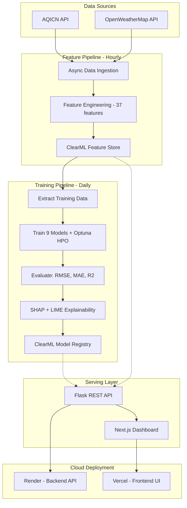

<div align="center">

# Pearls AQI Predictor

**End-to-end Air Quality Index forecasting system for Sargodha, Pakistan**

Predicting AQI 72 hours (3 days) into the future using a modern ML pipeline

[](https://www.python.org/downloads/release/python-3110/)
[](https://flask.palletsprojects.com)
[](https://pytorch.org)
[](https://nextjs.org/)
[](https://clear.ml)
[](https://render.com/)
[](https://vercel.com/)

[Live Frontend](https://aqi-predictor-3cawg37a4-giki.vercel.app) | [Backend API](https://pearls-aqi-api.onrender.com)

</div>

---

## Overview

Pearls AQI Predictor is a production-ready, end-to-end machine learning system that forecasts Air Quality Index (AQI) **72 hours (3 days)** into the future for Sargodha, Pakistan (32.08N, 72.67E). The system features:

- **9 ML models** spanning linear, ensemble, gradient boosting, and deep learning approaches (with dynamic model selection in the UI)
- **Automated CI/CD pipelines** via GitHub Actions for hourly data ingestion and daily model retraining
- **ClearML** as the Feature Store and experiment tracking platform
- **SHAP-based explainability** with Temporal Grad-CAM for deep learning models
- **Modern Web Architecture** deploying the backend API on Render and the frontend on Vercel
- **Interactive dashboards** built with Next.js and Tailwind CSS

Built for the **Pearls Engineering Program** to demonstrate full-stack MLOps proficiency.

---

## System Architecture


```mermaid
flowchart TB
    subgraph Sources[Data Sources]
        A1[AQICN API]
        A2[OpenWeatherMap API]
    end

    subgraph FP[Feature Pipeline - Hourly]
        B1[Async Data Ingestion]
        B2[Feature Engineering - 37 features]
        B3[ClearML Feature Store]
    end

    subgraph TP[Training Pipeline - Daily]
        C1[Extract Training Data]
        C2[Train 9 Models + Optuna HPO]
        C3[Evaluate: RMSE, MAE, R2]
        C4[SHAP + LIME Explainability]
        C5[ClearML Model Registry]
    end

    subgraph SV[Serving Layer]
        D1[Flask REST API]
        D2[Next.js Dashboard]
    end

    subgraph Deploy[Cloud Deployment]
        E1[Render - Backend API]
        E2[Vercel - Frontend UI]
    end

    A1 --> B1
    A2 --> B1
    B1 --> B2
    B2 --> B3

    B3 --> C1
    C1 --> C2
    C2 --> C3
    C3 --> C4
    C4 --> C5

    C5 -.-> D1
    B3 -.-> D1
    D1 --> D2
    
    D1 --> E1
    D2 --> E2
```

---

## Key Features

| Category | Details |
|----------|---------|
| **Multi-Model Zoo** | 9 models versioned locally and in ClearML: Ridge, ElasticNet, Random Forest, Extra Trees, Gradient Boosting, SVR, LightGBM, XGBoost, Bi-LSTM + Attention |
| **Feature Store** | ClearML Dataset versioning with local Parquet (Hive-partitioned by year/month) |
| **Experiment Tracking** | ClearML for model registry, metrics logging, and artifact management |
| **Explainability** | SHAP TreeExplainer + GradientExplainer, LIME TabularExplainer, Temporal Grad-CAM |
| **Drift Detection** | Population Stability Index (PSI) monitoring across all features |
| **Anomaly Detection** | Isolation Forest for outlier identification in incoming data |
| **Health Advisories** | AQI-based alerts with context-aware recommendations |
| **CI/CD** | 5 modular GitHub Actions workflows for CI, data ingestion, training, and deployment |
| **Cloud Deployment** | Backend hosted on Render; Frontend hosted on Vercel |

---

## Tech Stack

| Layer | Technologies |
|-------|-------------|
| **API Backend** | Python 3.11, Flask 3.0+, flask-cors |
| **Frontend UI** | Next.js 14, React, Tailwind CSS, Framer Motion |
| **ML/DL** | scikit-learn, LightGBM, XGBoost, PyTorch 2.2+, Optuna |
| **Feature Store** | ClearML 1.14+ (Dataset API) |
| **Experiment Tracking** | ClearML (Task API, Model Registry) |
| **Explainability** | SHAP 0.42+, LIME 0.2+, Custom Temporal Grad-CAM |
| **Data Engineering** | Pandas, NumPy, SciPy, aiohttp, tenacity |
| **CI/CD** | GitHub Actions |
| **Hosting** | Render (Backend API), Vercel (Frontend Next.js) |
| **Configuration** | Pydantic v2, pydantic-settings, python-dotenv |
| **Testing** | pytest, pytest-asyncio, httpx |

---

## Quick Start

### Prerequisites

- Python 3.11+
- Node.js (for frontend)
- API keys: [AQICN](https://aqicn.org/data-platform/token/) and [OpenWeatherMap](https://openweathermap.org/api)
- ClearML account (free tier): [app.clear.ml](https://app.clear.ml)

### Installation

```bash
git clone https://github.com/Zain-ul-abdeen-773/AQI-Predictor.git
cd AQI-Predictor

python -m venv venv
source venv/bin/activate  # Linux/Mac
venv\Scripts\activate     # Windows

pip install -r requirements.txt
```

### Environment Configuration

```bash
cp .env.example .env
```

Edit `.env` with your credentials:

```env
AQICN_API_KEY=your_aqicn_token
OPENWEATHER_API_KEY=your_openweather_key
CLEARML_API_ACCESS_KEY=your_clearml_key
CLEARML_API_SECRET_KEY=your_clearml_secret
```

### Generate Training Data

```bash
python -m data_pipeline.backfill --years 5
```

### Train Models

```bash
# Train all models
python -m training_pipeline.train

# Train from CSV directly
python -m training_pipeline.train --csv
```

### Launch Application (Local)

```bash
# Start Flask API Backend
flask --app deployment.api.main:app run --port 8000

# Start Next.js Frontend (separate terminal)
cd deployment/web_app
npm install
npm run dev
```

---

## Project Structure

```
.
├── config/                         # Application configuration
│   ├── settings.py                 #   Pydantic BaseSettings
│   └── schemas.py                  #   Pydantic validation schemas
│
├── eda/                            # Exploratory Data Analysis
│   ├── run_eda.py                  #   10-stage base EDA pipeline
│   ├── advanced_eda.py             #   9-stage advanced statistical analysis
│   ├── EDA_Analysis.ipynb          #   Interactive Jupyter notebook
│   ├── plots/                      #   20 PNG visualizations
│   └── reports/                    #   26 CSV/JSON statistical reports
│
├── data_pipeline/                  # Data ingestion & feature engineering
│   ├── ingest.py                   #   Async AQICN + OpenWeather client
│   ├── backfill.py                 #   5-year historical data generation
│   └── transformers.py             #   37-feature engineering
│
├── feature_pipeline/               # Feature store management
│   └── register.py                 #   ClearML Dataset + local Parquet store
│
├── training_pipeline/              # Model training & evaluation
│   ├── train.py                    #   Training orchestrator (9 models)
│   ├── evaluation.py               #   Metrics + PSI drift + Isolation Forest anomaly
│   ├── explainability.py           #   SHAP TreeExplainer + GradientExplainer
│   ├── registry.py                 #   ClearML model versioning (all models)
│   └── models/                     #   Model implementations (Ridge, RF, XGBoost, etc.)
│
├── deployment/                     # Serving layer
│   ├── api/                        #   Flask REST API Backend
│   │   ├── main.py                 #     5 endpoints (predict, models, health, etc.)
│   │   └── dependencies.py         #     Disk-based model & feature loading
│   └── web_app/                    #   Next.js Frontend Dashboard
│       └── app/                    #     React components and pages
│
├── data/                           # Data storage
│   └── feature_store/              #   Hive-partitioned Parquet (year=YYYY/month=M/)
│
├── models/                         # Trained model artifacts
│   ├── training_report.json        #   Model comparison report
│   ├── model_registry.json         #   Manifest of all versioned models
│   └── <model_id>/                 #   Artifacts (model.pkl, explainer.pkl, metrics.json)
│
├── tests/                          # pytest test suite
│
├── docs/                           # Technical documentation (LaTeX + PDF)
│
├── .github/workflows/              # CI/CD automation
│   ├── ci.yml                      #   On PR/Push: Lint + Tests
│   ├── feature-pipeline.yml        #   Hourly: ingest → transform → ClearML push
│   ├── train.yml                   #   Daily: train 9 models → evaluate → registry
│   ├── deploy-api.yml              #   On Push to Backend: Deploy to Render
│   └── deploy-frontend.yml         #   On Push to Frontend: Deploy to Vercel
│
├── Dockerfile                      # API Docker container definition
├── requirements.txt                # Backend dependencies
└── requirements-deploy.txt         # Lightweight production dependencies
```

---

## Models

### Model Zoo

| Model | Type | HPO | Description |
|-------|------|-----|-------------|
| Ridge Regression | Linear | Grid | L2-regularized with RobustScaler |
| ElasticNet | Linear | Grid | L1+L2 combined regularization |
| Random Forest | Ensemble | Default | Bagged decision trees |
| Extra Trees | Ensemble | Default | Extremely randomized trees |
| Gradient Boosting | Ensemble | Default | Sequential boosting |
| SVR | Kernel | Default | RBF kernel support vectors |
| LightGBM | GBDT | Optuna (50 trials) | Leaf-wise growth, TimeSeriesSplit CV |
| XGBoost | GBDT | Optuna (50 trials) | Level-wise growth, TimeSeriesSplit CV |
| Bi-LSTM + Attention | Deep Learning | Callbacks | Bidirectional LSTM + Multi-Head Self-Attention |

The training pipeline automatically trains **all 9 models** and registers them both locally (via `model_registry.json`) and in ClearML. The API dynamically loads these artifacts, allowing users to select any model in the frontend dashboard for inference.

---

## Feature Engineering

The system engineers **37 features** from raw pollutant and weather data:

| Feature Group | Features | Description |
|---------------|----------|-------------|
| **Cyclical Temporal** | `hour_sin/cos`, `day_sin/cos`, `month_sin/cos` | Preserves periodicity without discontinuities |
| **AQI Change Rate** | `aqi_change_1h`, `aqi_change_3h`, `aqi_change_6h` | Rate of change at multiple horizons |
| **Wind-Pollutant** | `wind_u_pm25`, `wind_v_pm25`, `wind_u_pm10`, `wind_v_pm10` | Vector decomposition x pollutant interaction |
| **Atmospheric** | `temp_humidity_index`, `thermal_inversion_flag` | Boundary layer and inversion detection |
| **Lag Features** | `aqi_lag_6h`, `aqi_lag_12h`, `aqi_lag_24h` | Autoregressive inputs (leakage-safe) |
| **Rolling Stats** | `pm25_rolling_mean_6h`, `pm25_rolling_std_6h`, `pm25_rolling_mean_24h` | Short/long-term statistical trends |
| **Pollution Index** | `pollution_intensity` | Composite normalized pollutant score |

> **Leakage Prevention**: Short-horizon lags (1h, 3h) are excluded from training features to prevent information leakage in the 72-hour forecasting context.

---

## Exploratory Data Analysis

Comprehensive 19-stage EDA on **43,801 hourly observations** spanning **5 years** (2021-2026) with **47 engineered features**. The analysis includes base statistical profiling, advanced time-series diagnostics, hypothesis testing, and causal inference.

**Reproduce:** `python -m eda.run_eda && python -m eda.advanced_eda`  
**Interactive notebook:** `eda/EDA_Analysis.ipynb`

*(See `eda/plots/` for visual artifacts like correlation heatmaps, empirical CDFs, and Granger causality tests).*

---

## API Reference

### Flask REST API Endpoints

| Method | Endpoint | Description |
|--------|----------|-------------|
| `GET` | `/health` | Service health check and readiness |
| `POST` | `/predict` | 72-hour AQI forecast with confidence intervals |
| `POST` | `/explain` | SHAP feature contribution analysis |
| `GET` | `/historical` | Historical AQI data for charting |
| `GET` | `/models` | List all 9 available models from the registry |

### Example Usage

```bash
# Health check
curl https://pearls-aqi-api.onrender.com/health

# 72-hour forecast (default model)
curl -X POST https://pearls-aqi-api.onrender.com/predict

# Forecast with specific model
curl -X POST "https://pearls-aqi-api.onrender.com/predict?model_id=ridge"

# List available models
curl https://pearls-aqi-api.onrender.com/models
```

---

## CI/CD Pipelines

### GitHub Actions Workflows

| Workflow | Schedule | Purpose |
|----------|----------|---------|
| `ci.yml` | On PR / Push | Runs Ruff (linting), pytest, and import smoke tests. |
| `feature-pipeline.yml`| Hourly | Ingests live data from APIs, engineers features, pushes to ClearML. |
| `train.yml` | Daily at 02:00 UTC | Trains all 9 models, evaluates, and updates the local & ClearML registry. |
| `deploy-api.yml` | On backend Push | Triggers a Render deploy hook and verifies API health. |
| `deploy-frontend.yml` | On frontend Push | Waits for Vercel auto-deploy and runs a basic HTTP smoke test. |

---

## Cloud Deployment

### Backend (Render)
The Flask API is containerized using the provided `Dockerfile` and hosted on Render. Render automatically pulls the latest code from GitHub and deploys the container. The `deploy-api.yml` GitHub action acts as a monitor, triggering the specific deploy hook and ensuring the API returns a `200 OK` health check post-deployment.

### Frontend (Vercel)
The Next.js dashboard is hosted on Vercel. Vercel integrates seamlessly with GitHub to automatically build and deploy the frontend whenever changes are pushed to the `deployment/web_app` directory. The Vercel project is configured with the `NEXT_PUBLIC_API_URL` environment variable to connect directly to the Render backend.

---

## Environment Variables

| Variable | Description | Default |
|----------|-------------|---------|
| `AQICN_API_KEY` | AQICN data platform token | `demo` |
| `OPENWEATHER_API_KEY` | OpenWeatherMap API key | -- |
| `CLEARML_API_ACCESS_KEY` | ClearML access key | -- |
| `CLEARML_API_SECRET_KEY` | ClearML secret key | -- |
| `TARGET_CITY` | Forecast target city | `Sargodha` |
| `FORECAST_HORIZON_HOURS` | Prediction window | `72` |
| `LOOKBACK_WINDOW_HOURS` | Input sequence length | `72` |
| `AQI_ALERT_THRESHOLD` | Health alert trigger | `150` |
| `OPTUNA_N_TRIALS` | HPO trial budget | `50` |

---

## License

This project is licensed under the MIT License. Built for the [Pearls Engineering Program](https://pearls.tech).

---

<div align="center">

**Developed by [Zain ul Abdeen](https://github.com/Zain-ul-abdeen-773)**

</div>
