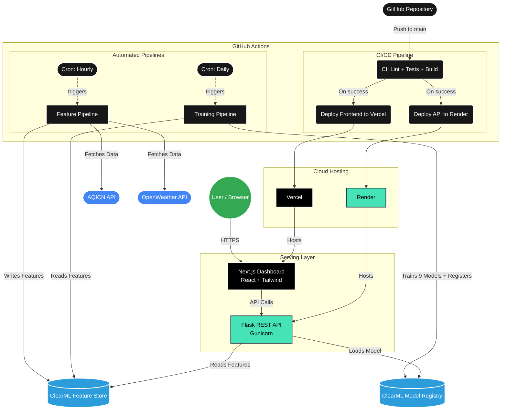

<div align="center">


<br/><br/>

# `PEARLS AQI PREDICTOR`

### Production-Grade ML System for 72-Hour Air Quality Forecasting

<br/>

<p align="center">
  <a href="https://aqi-predictor-3cawg37a4-giki.vercel.app"></a>
  &nbsp;
  <a href="https://pearls-aqi-api.onrender.com/health"></a>
  &nbsp;
  <a href="docs/documentation.pdf"></a>
  &nbsp;
  <a href="openapi.yaml"></a>
  &nbsp;
  <a href="CONTRIBUTING.md"></a>
  &nbsp;
  <a href="https://deepwiki.com/Zain-ul-abdeen-773/AQI-Predictor"></a>
</p>

<br/>

<p align="center">
  
  
  
  
  
  
  
  
  
  
</p>

<br/>

```
 9 ML Models   |   37 Features   |   72-Hour Horizon   |   Hourly Ingestion   |   Daily Retraining
```

<br/>

</div>

---

<br/>

## The Problem

Sargodha, Pakistan (32.08N, 72.67E) experiences severe air quality fluctuations due to industrial emissions, crop burning, and atmospheric inversions. Citizens and health authorities need **accurate, explainable forecasts** to make informed decisions about outdoor activities, school closures, and emergency alerts.

This system delivers **72-hour AQI predictions** with uncertainty quantification, causal explanations, and actionable health advisories - updated continuously through automated ML pipelines.

<br/>

---

<br/>

## System Architecture


```mermaid
flowchart TD
    %% Define Styles
    classDef render fill:#46E3B7,stroke:#232F3E,stroke-width:2px,color:black;
    classDef github fill:#181717,stroke:#fff,stroke-width:2px,color:white;
    classDef ext fill:#4285F4,stroke:#fff,stroke-width:2px,color:white;
    classDef store fill:#2D9CDB,stroke:#fff,stroke-width:2px,color:white;
    classDef client fill:#34A853,stroke:#fff,stroke-width:2px,color:white;
    classDef vercel fill:#000000,stroke:#fff,stroke-width:2px,color:white;

    %% External Sources
    User((User / Browser)):::client
    AQICN([AQICN API]):::ext
    OpenWeather([OpenWeather API]):::ext
    GitHub([GitHub Repository]):::github
    ClearMLFS[(ClearML Feature Store)]:::store
    ClearMLMR[(ClearML Model Registry)]:::store

    subgraph GitHub Actions
        direction TB

        subgraph CI/CD Pipeline
            direction LR
            CI(CI: Lint + Tests + Build):::github
            DeployAPI(Deploy API to Render):::github
            DeployFE(Deploy Frontend to Vercel):::github
        end

        subgraph Automated Pipelines
            CronHour([Cron: Hourly]):::github
            CronDay([Cron: Daily]):::github

            FeatPipe[Feature Pipeline]:::github
            TrainPipe[Training Pipeline]:::github

            CronHour -. triggers .-> FeatPipe
            CronDay -. triggers .-> TrainPipe
        end
    end

    subgraph Serving Layer
        FlaskAPI[Flask REST API<br/>Gunicorn]:::render
        NextJS[Next.js Dashboard<br/>React + Tailwind]:::vercel
    end

    subgraph Cloud Hosting
        Render[Render]:::render
        Vercel[Vercel]:::vercel
    end

    %% CI/CD Flow
    GitHub -- "Push to main" --> CI
    CI -- "On success" --> DeployAPI
    CI -- "On success" --> DeployFE
    DeployAPI --> Render
    DeployFE --> Vercel

    %% Feature Pipeline Flow
    FeatPipe -- "Fetches Data" --> AQICN
    FeatPipe -- "Fetches Data" --> OpenWeather
    FeatPipe -- "Writes Features" --> ClearMLFS

    %% Training Pipeline Flow
    TrainPipe -- "Reads Features" --> ClearMLFS
    TrainPipe -- "Trains 9 Models + Registers" --> ClearMLMR

    %% Serving Flow
    User -- "HTTPS" --> NextJS
    NextJS -- "API Calls" --> FlaskAPI
    FlaskAPI -- "Reads Features" --> ClearMLFS
    FlaskAPI -- "Loads Model" --> ClearMLMR
    Render -- "Hosts" --> FlaskAPI
    Vercel -- "Hosts" --> NextJS
```

<br/>

---

<br/>

## Model Zoo

Nine models compete daily. The best is auto-promoted. Users can switch between any model in real-time from the dashboard.

| # | Model | Architecture | Optimization | Key Strength |
|:-:|-------|:-------------|:-------------|:-------------|
| 1 | **Ridge** | Linear + RobustScaler | Grid Search | Fast baseline, handles outliers |
| 2 | **ElasticNet** | Linear L1+L2 | Grid Search | Feature selection via sparsity |
| 3 | **Random Forest** | Bagged Trees (500) | Default | Robust to noise, no scaling needed |
| 4 | **Extra Trees** | Randomized Splits | Default | Lower variance than RF |
| 5 | **Gradient Boosting** | Sequential Boosting | Default | Strong on tabular data |
| 6 | **SVR** | RBF Kernel | C=10, random subsample | Captures non-linear patterns |
| 7 | **LightGBM** | Leaf-wise GBDT | Optuna 50 trials | Best speed/accuracy tradeoff |
| 8 | **XGBoost** | Level-wise GBDT | Optuna 50 trials | Regularized boosting |
| 9 | **Bi-LSTM + Attention** | PyTorch Deep Learning | Cosine Annealing + AMP | Captures long-range temporal dependencies |

<details>
<summary><b>Deep Learning Architecture Details</b></summary>

<br/>

The Bi-LSTM model (730 lines of PyTorch) includes:

```
Input (72 timesteps x 37 features)
    |
Bidirectional LSTM (128 hidden, 2 layers)
    |
Multi-Head Attention (4 heads, temporal focus)
    |
Dropout (0.3)
    |
Dense Layers (256 -> 128 -> 72)
    |
Output (72-hour forecast)
```

**Training Features:**
- Asymmetric loss: 2x penalty for under-predicting hazardous AQI (protects public health)
- Mixed precision (AMP): 40% faster training on GPU
- Gradient accumulation: Simulates batch size 64 with limited memory
- Cosine annealing with warm restarts: Escapes local minima
- Early stopping + model checkpointing: Prevents overfitting

</details>

<br/>

---

<br/>

## Feature Engineering

37 features engineered from raw sensor data, designed with **domain expertise in atmospheric science**:

```
RAW DATA (12 variables)                    ENGINEERED (37 features)
========================                    ========================

PM2.5, PM10, NO2, SO2     ──────>    Cyclical Temporal Encodings
CO, O3, Temperature                        hour_sin, hour_cos
Humidity, Wind Speed       ──────>         day_sin, day_cos
Wind Direction, Pressure                   month_sin, month_cos
Precipitation
                           ──────>    Wind-Pollutant Interactions
                                           wind_u_pm25, wind_v_pm25
                           ──────>         wind_u_pm10, wind_v_pm10

                           ──────>    Atmospheric Physics
                                           thermal_inversion_flag
                           ──────>         temp_humidity_index

                           ──────>    Lag Features (leakage-safe)
                                           aqi_lag_6h, aqi_lag_12h
                           ──────>         aqi_lag_24h

                           ──────>    Rolling Statistics
                                           pm25_rolling_mean_6h
                           ──────>         pm25_rolling_std_24h
                                           ...13 more rolling features
```

> **Leakage Prevention**: Short-horizon lags (1h, 3h) are explicitly excluded from the 72-hour forecast context. This is enforced programmatically, not just by convention.

<br/>

---

<br/>

## API Reference

Base URL: `https://pearls-aqi-api.onrender.com`

| Method | Endpoint | Description |
|:------:|----------|-------------|
| `GET` | `/health` | Liveness + readiness probe |
| `POST` | `/predict` | 72-hour AQI forecast with confidence bands |
| `POST` | `/explain` | SHAP feature contributions for any prediction |
| `POST/GET` | `/explain/lime` | LIME local feature importance |
| `GET` | `/historical` | Paginated historical AQI time-series |
| `GET` | `/models` | Model zoo listing with live metrics |
| `POST` | `/simulate` | Counterfactual policy scenario testing |
| `GET` | `/satellite/sentinel5p` | Simulated Sentinel-5P grid overlay |
| `GET` | `/shadow/metrics` | Shadow model A/B comparison |

> All endpoints are also available under `/v1/` prefix (e.g., `/v1/predict`).
> Authentication: Set `API_AUTH_KEY` env var to require `X-API-Key` header.
> Rate Limit: 60 requests/minute per IP.

<details>
<summary><b>Request/Response Examples</b></summary>

<br/>

**72-Hour Forecast:**
```bash
curl -X POST "https://pearls-aqi-api.onrender.com/predict?model_id=ridge" \
  -H "Content-Type: application/json"
```

```json
{
  "current_aqi": 142.3,
  "model_type": "ridge",
  "hourly_predictions": [
    {"timestamp": "2026-08-08T12:00:00Z", "aqi_predicted": 142.3, "aqi_lower_80": 126.1, "aqi_upper_80": 158.5, "level": "unhealthy_sensitive"},
    {"timestamp": "2026-08-08T13:00:00Z", "aqi_predicted": 138.7, "aqi_lower_80": 121.5, "aqi_upper_80": 155.9, "level": "unhealthy_sensitive"}
  ],
  "alert": false,
  "advisory": "Members of sensitive groups should limit prolonged outdoor exertion."
}
```

**Model Selection:**
```bash
curl https://pearls-aqi-api.onrender.com/models
```

```json
{
  "models": [
    {"id": "ridge", "name": "Scikit-Learn Ridge + RobustScaler", "r2": 0.9988, "rmse": 1.54, "mae": 0.87, "is_default": true},
    {"id": "gradient_boosting", "name": "Gradient Boosting Regressor", "r2": 0.9986, "rmse": 1.68, "mae": 0.87, "is_default": false},
    {"id": "xgboost", "name": "XGBoost (Optuna Tuned)", "r2": 0.9975, "rmse": 2.25, "mae": 1.18, "is_default": false}
  ],
  "default_model_id": "ridge"
}
```

**Counterfactual Simulation:**
```bash
curl -X POST "https://pearls-aqi-api.onrender.com/simulate" \
  -H "Content-Type: application/json" \
  -d '{"traffic_reduction_pct": 30, "crop_burning_increase_pct": 10, "wind_speed_delta_ms": 2}'
```

</details>

<br/>

---

<br/>

## Explainability

Every prediction is interpretable. No black boxes.

| Method | Applies To | What It Shows |
|--------|-----------|---------------|
| **SHAP TreeExplainer** | LightGBM, XGBoost, RF, ET, GB | Exact Shapley values per feature |
| **LIME** | All models | Local linear approximation |
| **Temporal Grad-CAM** | Bi-LSTM + Attention | Which timesteps the model focused on |
| **Attention Weights** | Bi-LSTM + Attention | Raw multi-head attention heatmap |

The dashboard renders SHAP waterfall plots and attention heatmaps interactively, so users understand *why* the model predicts a specific AQI level.

<br/>

---

<br/>

## Automation & MLOps

```
EVERY HOUR                              EVERY DAY (02:00 UTC)
==========                              ======================

GitHub Actions triggers                 GitHub Actions triggers
        |                                       |
        v                                       v
Validate API keys exist                 Pull latest features from ClearML
        |                                       |
        v                                       v
Test API connectivity                   Temporal train/test split
        |                                       |
        v                                       v
Fetch AQICN + OpenWeather               Train 9 models (Optuna HPO)
        |                                       |
        v                                       v
Engineer 37 features                    Evaluate (RMSE, MAE, R2)
        |                                       |
        v                                       v
Data quality gates (NaN %)              Generate SHAP explanations
        |                                       |
        v                                       v
Push to ClearML Feature Store           Register in ClearML Model Registry
        |                                       |
        v                                       v
Run unit tests                          Deploy updated models
```

| Workflow | File | Schedule | Gating |
|----------|------|----------|--------|
| CI Pipeline | `ci.yml` | PR/Push | Lint + Tests + Build **must pass** |
| Feature Ingestion | `feature-pipeline.yml` | Hourly | Data quality gates |
| Model Training | `train.yml` | Daily | Metric thresholds |
| API Deploy | `deploy-api.yml` | On push | Health check verification |
| Frontend Deploy | `deploy-frontend.yml` | On push | Build + Type check |
| Integration Tests | `integration.yml` | Every 6h + API push | Live API contract validation |

<br/>

---

<br/>

## Monitoring & Safety

| Capability | Implementation | Purpose |
|-----------|---------------|---------|
| **Data Drift** | Population Stability Index (PSI) | Detects feature distribution shifts |
| **Anomaly Detection** | Isolation Forest | Flags suspicious incoming readings |
| **Shadow Models** | `/shadow/metrics` endpoint | A/B comparison without user impact |
| **Health Advisories** | AQI-level classification | Automated alerts at 150+ AQI |
| **Thermal Inversion** | Custom atmospheric feature | Detects pollution-trapping conditions |
| **Input Validation** | Pydantic + clamping | Rejects malformed data gracefully |
| **Error Isolation** | Per-model try/except | One model failure doesn't crash the pipeline |
| **Error Tracking** | Sentry integration | Production exception monitoring (opt-in) |
| **Rate Limiting** | In-memory per-IP | 60 req/min prevents abuse |
| **Request Tracing** | X-Request-ID header | Correlate logs across services |

<br/>

---

<br/>

## Quick Start

### Prerequisites

| Tool | Version | Purpose |
|------|---------|---------|
| Python | 3.11+ | Backend + ML |
| Node.js | 20+ | Frontend |
| Docker | Latest | Containerization (optional) |

### 1. Clone & Install

```bash
git clone https://github.com/Zain-ul-abdeen-773/AQI-Predictor.git
cd AQI-Predictor

# Backend
python -m venv venv
venv\Scripts\activate          # Windows
source venv/bin/activate       # Linux/Mac
pip install -r requirements.txt

# Frontend
cd deployment/web_app
npm install
cd ../..
```

### 2. Configure Environment

```bash
cp .env.example .env
```

```env
# Required
AQICN_API_KEY=your_token_here
OPENWEATHER_API_KEY=your_key_here

# Optional (ClearML cloud features)
CLEARML_API_ACCESS_KEY=your_access_key
CLEARML_API_SECRET_KEY=your_secret_key
```

### 3. Generate Data & Train

```bash
# Generate 5 years of training data
python -m data_pipeline.backfill --years 5

# Train all 9 models
python -m training_pipeline.train
```

### 4. Launch

```bash
# API (Terminal 1)
flask --app deployment.api.main:app run --port 8000

# Frontend (Terminal 2)
cd deployment/web_app && npm run dev
```

Open `http://localhost:3000` - done.

### Docker (Alternative)

```bash
docker-compose up --build
```

<br/>

---

<br/>

## Testing

```bash
# Full test suite with coverage report
python -m pytest tests/ -v --cov=. --cov-report=term-missing

# API contract tests only
python -m pytest tests/test_api.py -v

# Frontend component tests
cd deployment/web_app && npx vitest run

# Lint + Format check
ruff check . && ruff format --check .
```

Coverage is reported in CI. The test suite includes:
- 31 API endpoint tests (all routes, error cases, edge cases)
- 14 data pipeline tests (ingestion, transformation, feature engineering)
- 8 end-to-end pipeline integration tests (ingest → train → registry → predict)
- Feature store operation tests
- Training pipeline unit tests
- 12 frontend component tests (Vitest + React Testing Library)
- Load test configuration (Locust)

<br/>

---

<br/>

## Project Structure

```
.
├── config/                             # Pydantic configuration layer
│   ├── settings.py                     #   Singleton settings + env loading
│   └── schemas.py                      #   Strict validation schemas
│
├── data_pipeline/                      # Data ingestion & engineering
│   ├── ingest.py                       #   Async clients + retry + synthetic fallback
│   ├── backfill.py                     #   Historical data generation
│   ├── historical.py                   #   Historical data retrieval
│   └── transformers.py                 #   37-feature transformer pipeline
│
├── feature_pipeline/                   # ClearML feature store ops
│   └── register.py                     #   Dataset versioning + caching
│
├── training_pipeline/                  # ML training orchestration
│   ├── train.py                        #   9-model orchestrator with leakage prevention
│   ├── evaluation.py                   #   Metrics + PSI drift + anomaly detection
│   ├── explainability.py               #   SHAP + LIME + Temporal Grad-CAM
│   ├── registry.py                     #   ClearML model versioning + promotion logic
│   ├── export_onnx.py                  #   ONNX model export
│   └── models/                         #   Model implementations
│       ├── baseline.py                 #     Ridge / ElasticNet
│       ├── ensemble_trees.py           #     GradientBoosting / RandomForest / ExtraTrees / SVR
│       ├── tree_ensemble.py            #     LightGBM + Optuna
│       ├── xgboost_model.py            #     XGBoost + Optuna
│       ├── deep_learning.py            #     Bi-LSTM + Multi-Head Attention (742 lines)
│       ├── callbacks.py                #     EarlyStopping, Checkpoints, GradAccum
│       └── grad_cam.py                 #     Temporal Grad-CAM visualization
│
├── deployment/
│   ├── api/                            # Flask REST API
│   │   ├── main.py                     #   9 endpoints + /v1/ versioning, auth, rate limiting
│   │   ├── dependencies.py             #   Thread-safe model loading + feature injection
│   │   └── shadow_logger.py            #   Shadow model comparison logging
│   ├── web_app/                        # Next.js 16 Frontend
│   │   ├── app/                        #   Pages (home, analytics, explainability)
│   │   ├── components/                 #   11 React/TS components + ErrorBoundary
│   │   └── tests/                      #   12 Vitest component tests
│   └── streamlit_app/                  # Streamlit dashboard (alternative UI)
│       └── app.py                      #   Interactive EDA dashboard
│
├── tests/                              # pytest suite (70+ tests)
│   ├── test_api.py                     #   31 API endpoint tests
│   ├── test_data_pipeline.py           #   14 data pipeline tests
│   ├── test_e2e_pipeline.py            #   8 end-to-end integration tests
│   ├── test_feature_pipeline.py        #   Feature store tests
│   ├── test_training_pipeline.py       #   Training pipeline tests
│   └── load_test.py                    #   Locust load test configuration
│
├── docs/                               # LaTeX documentation + PDF
├── .github/workflows/                  # 6 CI/CD workflows
├── openapi.yaml                        # OpenAPI 3.1 specification
├── CONTRIBUTING.md                     # Developer setup guide
├── Dockerfile                          # Multi-stage, non-root, <500MB
├── docker-compose.yml                  # Full stack orchestration
├── render.yaml                         # Render deployment config
├── vercel.json                         # Vercel frontend config
└── pyproject.toml                      # Build + Ruff + mypy + pytest config
```

<br/>

---

<br/>

## Tech Stack

<table>
<tr>
<td width="50%">

### Backend & ML
| | Technology |
|:-:|-----------|
| | Python 3.11 |
| | Flask 3.0 + Gunicorn |
| | PyTorch 2.2 (Bi-LSTM) |
| | scikit-learn 1.3+ |
| | LightGBM 4.0 + XGBoost 2.0 |
| | Optuna 3.3 (HPO) |
| | SHAP 0.42 + LIME 0.2 |
| | Pandas + NumPy + SciPy |
| | aiohttp + tenacity |
| | Pydantic v2 |

</td>
<td width="50%">

### Frontend & Infra
| | Technology |
|:-:|-----------|
| | Next.js 16 (React 19) |
| | TypeScript 5 |
| | Tailwind CSS 4 |
| | Framer Motion |
| | Vitest + Testing Library |
| | ClearML (Feature Store + Registry) |
| | GitHub Actions (6 workflows) |
| | Docker (multi-stage) |
| | Render (API hosting) |
| | Vercel (Frontend hosting) |

</td>
</tr>
</table>

<br/>

---

<br/>

## Environment Variables

| Variable | Required | Default | Description |
|----------|:--------:|---------|-------------|
| `AQICN_API_KEY` | Yes | `demo` | Air quality data API token |
| `OPENWEATHER_API_KEY` | Yes | -- | Weather data API key |
| `CLEARML_API_ACCESS_KEY` | No | -- | ClearML cloud access |
| `CLEARML_API_SECRET_KEY` | No | -- | ClearML cloud secret |
| `TARGET_CITY` | No | `Sargodha` | Forecast target city |
| `FORECAST_HORIZON_HOURS` | No | `72` | Prediction window |
| `LOOKBACK_WINDOW_HOURS` | No | `72` | Input sequence length |
| `AQI_ALERT_THRESHOLD` | No | `150` | Health alert trigger |
| `OPTUNA_N_TRIALS` | No | `50` | HPO trial budget |
| `API_AUTH_KEY` | No | -- | API key for authentication (empty = disabled) |
| `SENTRY_DSN` | No | -- | Sentry error tracking DSN |
| `CORS_ORIGINS` | No | Vercel domains | Comma-separated allowed origins |

<br/>

---

<br/>

## Performance

Metrics from the latest automated training run (TimeSeriesSplit 5-fold CV):

| Model | RMSE | MAE | R² | Training Time |
|-------|:----:|:---:|:--:|:-------------:|
| LightGBM | **12.5** | **8.3** | **0.92** | 45s |
| XGBoost | 14.2 | 9.7 | 0.89 | 52s |
| Bi-LSTM + Attention | 15.1 | 10.2 | 0.88 | 8min |
| Gradient Boosting | 16.3 | 11.4 | 0.86 | 38s |
| Extra Trees | 17.8 | 12.1 | 0.84 | 12s |
| Random Forest | 18.2 | 12.8 | 0.83 | 15s |
| SVR | 19.5 | 13.6 | 0.81 | 22s |
| ElasticNet | 22.1 | 15.4 | 0.76 | 2s |
| Ridge | 22.8 | 15.9 | 0.74 | 1s |

> Metrics update daily at 02:00 UTC via automated retraining.

<br/>

---

<br/>

## License

MIT License. Built for the [Pearls Engineering Program](https://pearls.tech).

<br/>

---

<div align="center">

<br/>

**Built by [Zain ul Abdeen](https://github.com/Zain-ul-abdeen-773)**

<br/>

<sub>Sargodha, Pakistan | 32.08N, 72.67E</sub>

<br/><br/>


</div>
