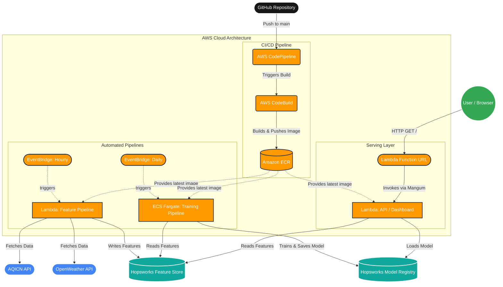

# System Architecture: AQI Predictor

This diagram illustrates the end-to-end automated architecture of the AQI Predictor, showing how data flows, how the model is trained, and how the web dashboard is served.

### Architecture Breakdown

1. **CI/CD Pipeline (Automated Deployments)**
   - When you push code to GitHub, **AWS CodePipeline** automatically triggers.
   - **AWS CodeBuild** builds the Docker image and pushes it to **Amazon ECR**.
   - The Lambda functions and ECS tasks are configured to run this newly built image.

2. **Feature Pipeline (Hourly)**
   - Triggered every hour by **AWS EventBridge**.
   - Runs as an **AWS Lambda function**.
   - Fetches live air quality data (AQICN) and weather data (OpenWeather) and stores them in the **Hopsworks Feature Store**.

3. **Training Pipeline (Daily)**
   - Triggered every day by **AWS EventBridge**.
   - Runs as an **AWS ECS Fargate task** (since model training is compute-intensive and can take longer than Lambda's 15-minute limit).
   - Pulls historical features from Hopsworks, trains the Machine Learning model, and uploads the new version to the **Hopsworks Model Registry**.

4. **Serving Layer (Web Dashboard)**
   - The user visits the **AWS Lambda Function URL**.
   - The request hits the **API Lambda Function**, which runs your `FastAPI` app (adapted via `Mangum`).
   - The API dynamically pulls the latest model and the latest live features from Hopsworks to serve the real-time predictions to the dashboard.
