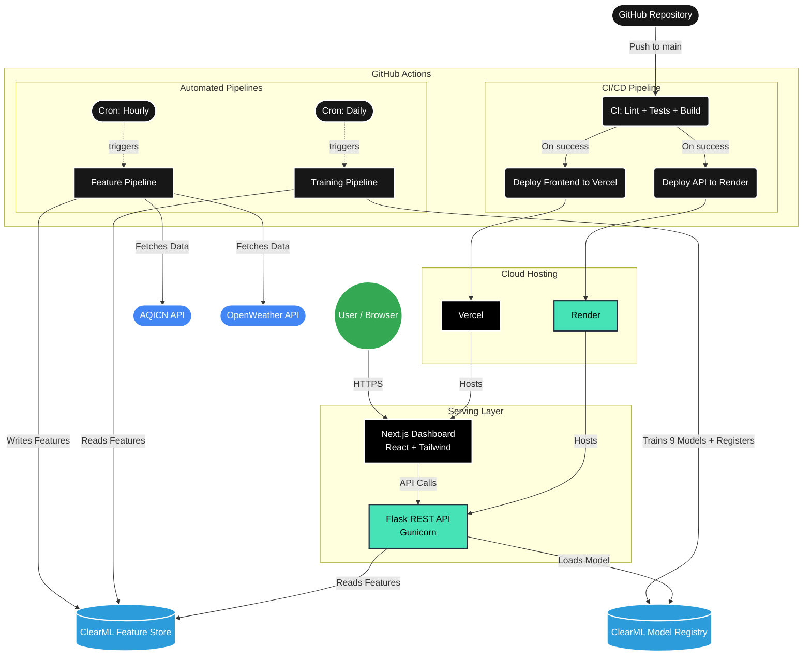

# System Architecture: AQI Predictor

This diagram illustrates the end-to-end automated architecture of the AQI Predictor, showing how data flows, how models are trained, and how the web dashboard is served.

```mermaid
flowchart TD
    %% Define Styles
    classDef render fill:#46E3B7,stroke:#232F3E,stroke-width:2px,color:black;
    classDef github fill:#181717,stroke:#fff,stroke-width:2px,color:white;
    classDef ext fill:#4285F4,stroke:#fff,stroke-width:2px,color:white;
    classDef store fill:#2D9CDB,stroke:#fff,stroke-width:2px,color:white;
    classDef client fill:#34A853,stroke:#fff,stroke-width:2px,color:white;
    classDef vercel fill:#000000,stroke:#fff,stroke-width:2px,color:white;

    %% External Sources
    User((User / Browser)):::client
    AQICN([AQICN API]):::ext
    OpenWeather([OpenWeather API]):::ext
    GitHub([GitHub Repository]):::github
    ClearMLFS[(ClearML Feature Store)]:::store
    ClearMLMR[(ClearML Model Registry)]:::store

    subgraph GitHub Actions
        direction TB

        subgraph CI/CD Pipeline
            direction LR
            CI(CI: Lint + Tests + Build):::github
            DeployAPI(Deploy API to Render):::github
            DeployFE(Deploy Frontend to Vercel):::github
        end

        subgraph Automated Pipelines
            CronHour([Cron: Hourly]):::github
            CronDay([Cron: Daily]):::github

            FeatPipe[Feature Pipeline]:::github
            TrainPipe[Training Pipeline]:::github

            CronHour -. triggers .-> FeatPipe
            CronDay -. triggers .-> TrainPipe
        end
    end

    subgraph Serving Layer
        FlaskAPI[Flask REST API<br/>Gunicorn]:::render
        NextJS[Next.js Dashboard<br/>React + Tailwind]:::vercel
    end

    subgraph Cloud Hosting
        Render[Render]:::render
        Vercel[Vercel]:::vercel
    end

    %% CI/CD Flow
    GitHub -- "Push to main" --> CI
    CI -- "On success" --> DeployAPI
    CI -- "On success" --> DeployFE
    DeployAPI --> Render
    DeployFE --> Vercel

    %% Feature Pipeline Flow
    FeatPipe -- "Fetches Data" --> AQICN
    FeatPipe -- "Fetches Data" --> OpenWeather
    FeatPipe -- "Writes Features" --> ClearMLFS

    %% Training Pipeline Flow
    TrainPipe -- "Reads Features" --> ClearMLFS
    TrainPipe -- "Trains 9 Models + Registers" --> ClearMLMR

    %% Serving Flow
    User -- "HTTPS" --> NextJS
    NextJS -- "API Calls" --> FlaskAPI
    FlaskAPI -- "Reads Features" --> ClearMLFS
    FlaskAPI -- "Loads Model" --> ClearMLMR
    Render -- "Hosts" --> FlaskAPI
    Vercel -- "Hosts" --> NextJS
```

### Architecture Breakdown

1. **CI/CD Pipeline (GitHub Actions)**
   - On push to `main`, the **CI workflow** runs linting (Ruff), unit tests (pytest with coverage), API contract tests, and TypeScript build checks.
   - On success, **deploy workflows** trigger deployment to **Render** (backend) and **Vercel** (frontend).

2. **Feature Pipeline (Hourly)**
   - Triggered every hour by a **GitHub Actions cron** schedule.
   - Fetches live air quality data from AQICN and weather data from OpenWeatherMap using async HTTP with exponential backoff retry.
   - Applies 37 engineered features (cyclical encodings, wind-pollutant interactions, thermal inversion detection, lag features, rolling statistics).
   - Pushes processed features to the **ClearML Feature Store** as Hive-partitioned Parquet.

3. **Training Pipeline (Daily)**
   - Triggered daily by a **GitHub Actions cron** schedule.
   - Pulls historical features from ClearML, trains 9 ML models (Ridge, ElasticNet, Random Forest, Extra Trees, Gradient Boosting, SVR, LightGBM, XGBoost, Bi-LSTM + Attention) with Optuna hyperparameter optimization.
   - Evaluates models using temporal cross-validation (RMSE, MAE, R²) and generates SHAP/LIME explanations.
   - Registers the best model in the **ClearML Model Registry**.

4. **Serving Layer**
   - **Flask REST API** (hosted on Render): Endpoints for prediction, explainability, historical data, model selection, counterfactual simulation, satellite data, and shadow model comparison.
   - **Next.js Dashboard** (hosted on Vercel): Interactive frontend with model selection, forecast visualization, SHAP explanations, health advisories, and real-time monitoring.
