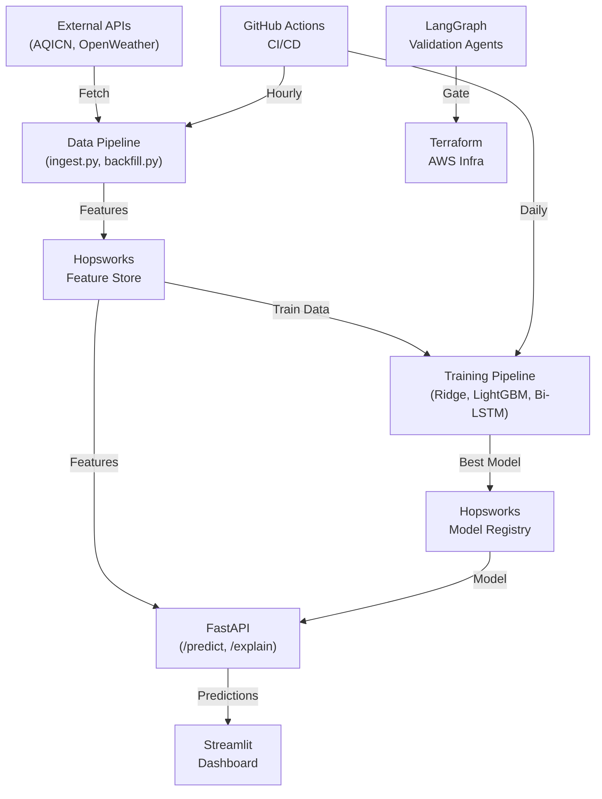

# Pearls AQI Predictor — Implementation Plan

An end-to-end, serverless, enterprise-grade ML system for predicting Air Quality Index (AQI) in Sargodha, Pakistan with 3-day forecasts, multi-model ML pipeline, SHAP explainability, agentic infra validation, and a premium Streamlit dashboard.

## Architecture Overview



---

## Project Structure

```
AQI Predictor/
├── config/
│   ├── __init__.py
│   ├── settings.py              # Pydantic BaseSettings for all env vars
│   └── schemas.py               # Pydantic validation schemas for data
├── data_pipeline/
│   ├── __init__.py
│   ├── ingest.py                # Real-time data fetching with retry
│   ├── backfill.py              # Historical data backfill (5 years, batched)
│   └── transformers.py          # Feature engineering transforms
├── feature_pipeline/
│   ├── __init__.py
│   └── register.py              # Hopsworks feature group creation & push
├── training_pipeline/
│   ├── __init__.py
│   ├── train.py                 # Orchestrator for model training
│   ├── models/
│   │   ├── __init__.py
│   │   ├── baseline.py          # Ridge/ElasticNet with RobustScaler
│   │   ├── tree_ensemble.py     # LightGBM + Optuna Bayesian tuning
│   │   └── deep_learning.py     # Bi-LSTM + Attention (PyTorch)
│   ├── evaluation.py            # RMSE, MAE, R², TimeSeriesSplit
│   ├── explainability.py        # SHAP TreeExplainer / GradientExplainer
│   └── registry.py              # Hopsworks model registry operations
├── deployment/
│   ├── api/
│   │   ├── __init__.py
│   │   ├── main.py              # FastAPI app with /predict, /explain, /health
│   │   ├── dependencies.py      # Dependency injection for model & features
│   │   └── middleware.py        # Error handling, CORS, rate limiting
│   └── dashboard/
│       ├── app.py               # Streamlit main dashboard
│       ├── components/
│       │   ├── __init__.py
│       │   ├── aqi_gauge.py     # Premium AQI circle gauge
│       │   ├── forecast_chart.py # 3-day Plotly timeline
│       │   ├── shap_chart.py    # SHAP contribution bar chart
│       │   ├── news_feed.py     # Regional news + sentiment
│       │   └── alerts.py        # Hazardous AQI alerts
│       └── styles/
│           └── theme.py         # Dark mode Scandinavian theme config
├── infrastructure/
│   ├── terraform/
│   │   ├── provider.tf
│   │   ├── variables.tf
│   │   ├── main.tf
│   │   └── outputs.tf
│   └── validation_agents/
│       ├── __init__.py
│       ├── validate.py          # LangGraph multi-agent validator
│       ├── agents/
│       │   ├── __init__.py
│       │   ├── linter.py        # Terraform linter agent
│       │   ├── security.py      # Checkov security scanner agent
│       │   └── policy.py        # OPA/Rego policy evaluation agent
│       └── policies/
│           └── aws_compliance.rego
├── tests/
│   ├── __init__.py
│   ├── test_data_pipeline.py
│   ├── test_feature_pipeline.py
│   ├── test_training_pipeline.py
│   └── test_api.py
├── .github/
│   └── workflows/
│       ├── feature_pipeline_cron.yml
│       └── training_pipeline_cron.yml
├── Dockerfile
├── docker-compose.yml
├── requirements.txt
├── pyproject.toml
├── README.md
└── .env.example
```

---

## Proposed Changes

### Component 1: Configuration Layer (`config/`)

#### [NEW] [settings.py](file:///d:/Study/AQI Predictor/config/settings.py)
- Pydantic `BaseSettings` with environment variable loading from `.env`
- All API keys (AQICN, OpenWeather, Hopsworks), coordinates (Sargodha), thresholds
- Typed configuration with validation and sensible defaults

#### [NEW] [schemas.py](file:///d:/Study/AQI Predictor/config/schemas.py)
- Pydantic models for raw API responses, processed features, predictions
- Strict type enforcement for all data flowing through pipelines

---

### Component 2: Data Pipeline (`data_pipeline/`)

#### [NEW] [ingest.py](file:///d:/Study/AQI Predictor/data_pipeline/ingest.py)
- `AQICNClient` — fetches PM2.5, PM10, NO2, SO2, CO, O3 from AQICN API v2
- `OpenWeatherClient` — fetches temp, humidity, wind speed/direction, pressure, precip
- Exponential backoff retry via `tenacity` (handles 429, 5xx)
- Concurrent fetching with `asyncio` + `aiohttp`

#### [NEW] [transformers.py](file:///d:/Study/AQI Predictor/data_pipeline/transformers.py)
- Cyclical temporal encoding (hour_sin/cos, day_sin/cos, month_sin/cos)
- AQI change rate (1h, 3h, 6h rolling windows)
- Wind-pollutant vector interaction (U/V decomposition × PM2.5/PM10)
- Boundary layer proxy (THI = temperature-humidity index)
- **Advanced**: Pollution rose features, thermal inversion detection, lag features (t-1, t-3, t-6, t-12, t-24)

#### [NEW] [backfill.py](file:///d:/Study/AQI Predictor/data_pipeline/backfill.py)
- Historical data generation for past 5 years
- Batch processing in chunks of 10,000 rows
- Progress tracking and resumable state

---

### Component 3: Feature Pipeline (`feature_pipeline/`)

#### [NEW] [register.py](file:///d:/Study/AQI Predictor/feature_pipeline/register.py)
- Hopsworks Feature Group `sargodha_aqi_features` (v1)
- Primary key: `timestamp`, event time: `timestamp`, partition: `year`, `month`
- Schema enforcement with precise types
- Online/offline store management

---

### Component 4: Training Pipeline (`training_pipeline/`)

#### [NEW] [models/baseline.py](file:///d:/Study/AQI Predictor/training_pipeline/models/baseline.py)
- Ridge/ElasticNet with `RobustScaler` pipeline
- Handles skewed pollutant distributions

#### [NEW] [models/tree_ensemble.py](file:///d:/Study/AQI Predictor/training_pipeline/models/tree_ensemble.py)
- LightGBM Regressor with Optuna Bayesian optimization
- Feature importance extraction

#### [NEW] [models/deep_learning.py](file:///d:/Study/AQI Predictor/training_pipeline/models/deep_learning.py)
- Bidirectional LSTM with custom Multi-Head Attention
- Input: 72h history → Output: 72h forecast (72, 1)
- AdamW optimizer + OneCycleLR scheduler
- **Asymmetric loss** penalizing hazardous under-predictions
- Dropout regularization

#### [NEW] [evaluation.py](file:///d:/Study/AQI Predictor/training_pipeline/evaluation.py)
- TimeSeriesSplit (5-fold) cross-validation
- RMSE, MAE, R² metric computation
- Model comparison and champion selection

#### [NEW] [explainability.py](file:///d:/Study/AQI Predictor/training_pipeline/explainability.py)
- SHAP TreeExplainer (LightGBM) and GradientExplainer (PyTorch)
- Serialization of explainer alongside model artifacts

#### [NEW] [registry.py](file:///d:/Study/AQI Predictor/training_pipeline/registry.py)
- Hopsworks Model Registry integration
- Tag: `sargodha_aqi_forecast_model`
- Metadata: validation metrics + hyperparameters as JSON

---

### Component 5: FastAPI Backend (`deployment/api/`)

#### [NEW] [main.py](file:///d:/Study/AQI Predictor/deployment/api/main.py)
- `GET /health` — liveness/readiness check
- `POST /predict` — fetch features → load model → 3-day AQI forecast
- `POST /explain` — SHAP values for current prediction payload
- `GET /historical` — historical AQI data for charting

#### [NEW] [dependencies.py](file:///d:/Study/AQI Predictor/deployment/api/dependencies.py)
- Dependency injection: model loader, feature store connector, caching

#### [NEW] [middleware.py](file:///d:/Study/AQI Predictor/deployment/api/middleware.py)
- Global exception handler, CORS, request logging, rate limiting

---

### Component 6: Streamlit Dashboard (`deployment/dashboard/`)

#### [NEW] [app.py](file:///d:/Study/AQI Predictor/deployment/dashboard/app.py)
- Scandinavian-minimalist dark mode (`#121212` bg, `#1E1E1E` sidebar)
- Main layout with AQI gauge, forecast chart, SHAP chart, news, alerts

#### [NEW] Dashboard Components:
- `aqi_gauge.py` — Animated CSS/SVG AQI circle with color transitions (Green → Yellow → Red)
- `forecast_chart.py` — 3-day interactive Plotly line chart (cubic interpolation, no gridlines)
- `shap_chart.py` — Horizontal SHAP contribution bar chart
- `news_feed.py` — RSS news ingestion + sentiment analysis (zero-shot classifier)
- `alerts.py` — Modal alerts for AQI > 150 with health advice

---

### Component 7: Infrastructure (`infrastructure/`)

#### [NEW] Terraform files
- `provider.tf` — AWS provider configuration
- `variables.tf` — Parameterized variables (API keys, schedules)
- `main.tf` — EventBridge + Lambda (feature) + ECS Fargate (training) + SSM
- `outputs.tf` — Resource ARNs and endpoints

#### [NEW] LangGraph Validation Agents
- `validate.py` — Multi-agent state graph orchestrator
- `AgentState` with: terraform_code, lint_results, security_issues, policy_compliance, approval_status
- Linter → Security (Checkov) → Policy (OPA/Rego) → Decision agent
- GitHub Actions integration (blocks deploy on failure)

---

### Component 8: CI/CD & DevOps

#### [NEW] `.github/workflows/feature_pipeline_cron.yml`
- Hourly trigger, installs deps, runs feature pipeline, pushes to Hopsworks, runs tests

#### [NEW] `.github/workflows/training_pipeline_cron.yml`
- Daily trigger, extracts data, checks drift, trains, evaluates, conditionally promotes

#### [NEW] `Dockerfile`
- Multi-stage build (builder + runtime), `python:3.11-slim`, < 500MB
- Gunicorn/Uvicorn worker configuration

#### [NEW] `docker-compose.yml`
- API + Dashboard services with health checks

---

### Component 9: Advanced Differentiators (My Additions)

> [!IMPORTANT]
> These advanced features are additions beyond the project requirements to make the submission stand out.

| Feature | Description |
|---|---|
| **Data Drift Detection** | Evidently AI integration to detect feature distribution shifts before retraining |
| **Anomaly Detection** | Isolation Forest running alongside AQI predictions to flag anomalous readings |
| **Thermal Inversion Detection** | Custom feature detecting atmospheric inversions that trap pollutants |
| **Lag Feature Engineering** | Autoregressive features at t-1, t-3, t-6, t-12, t-24 for improved LSTM context |
| **Ensemble Stacking** | Meta-learner combining Ridge + LightGBM + LSTM predictions |
| **Prediction Intervals** | Conformal prediction for uncertainty quantification (80% and 95% intervals) |
| **Air Quality Health Index** | Custom AQHI score mapping AQI to health risk categories with localized advice |
| **Pollution Rose** | Wind direction × pollutant concentration features for spatial dispersion modeling |
| **Model Versioning Lineage** | Full tracking of data version → features → model → predictions |
| **API Response Caching** | Redis-compatible TTL caching for /predict endpoint (5-min cache) |

---

## Open Questions

> [!IMPORTANT]
> **API Keys Required**: Do you already have API keys for:
> 1. **AQICN** (https://aqicn.org/api/) — free tier available
> 2. **OpenWeatherMap** (https://openweathermap.org/api) — free tier available
> 3. **Hopsworks** (https://www.hopsworks.ai/) — free tier available
>
> If not, I'll set up the code to work with `.env` configuration and include mock/synthetic data generation for development.

> [!NOTE]
> **No virtualenv**: As requested, all code will be written to run with your system Python. A `requirements.txt` will be provided for `pip install -r requirements.txt`.

---

## Execution Strategy

I'll build this in 5 phases, starting immediately:

1. **Phase 1** — Config + Data Pipeline + Feature Engineering (~15 files)
2. **Phase 2** — Feature Store + Training Pipeline + Models (~10 files)
3. **Phase 3** — FastAPI + Streamlit Dashboard (~10 files)
4. **Phase 4** — Infrastructure (Terraform + LangGraph Agents) (~8 files)
5. **Phase 5** — CI/CD + Docker + Tests + Documentation (~8 files)

## Verification Plan

### Automated Tests
- `pytest tests/` — Unit tests for each pipeline component
- `python -m data_pipeline.ingest --dry-run` — Validate API connectivity
- `docker build .` — Verify container builds under 500MB

### Manual Verification
- Run Streamlit dashboard locally: `streamlit run deployment/dashboard/app.py`
- Hit FastAPI endpoints: `http://localhost:8000/docs` (Swagger UI)
- Verify feature store writes via Hopsworks UI
