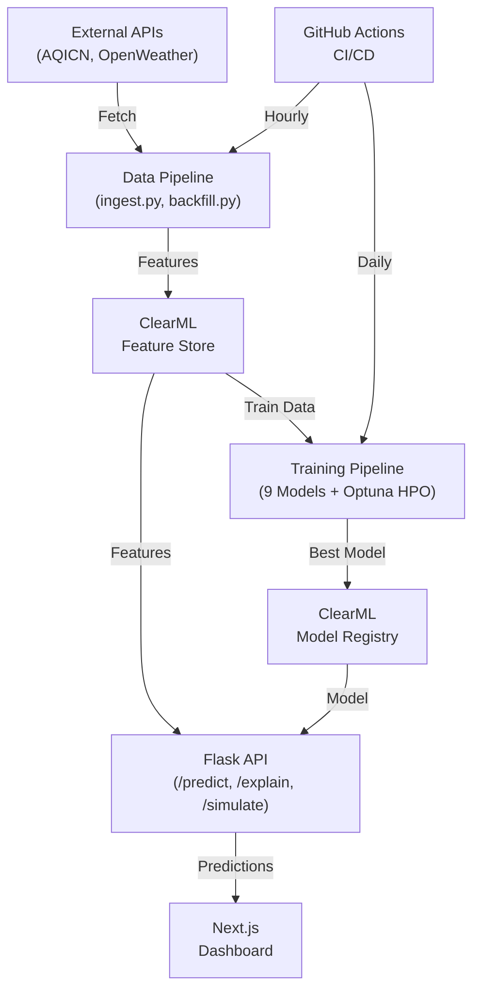

# Pearls AQI Predictor — Implementation Plan

An end-to-end ML system for predicting Air Quality Index (AQI) in Sargodha, Pakistan with 3-day forecasts, multi-model ML pipeline, SHAP/LIME explainability, and a modern Next.js dashboard.

## Architecture Overview


```mermaid
graph TD
    A["External APIs<br/>(AQICN, OpenWeather)"] -->|Fetch| B["Data Pipeline<br/>(ingest.py, backfill.py)"]
    B -->|Features| C["ClearML<br/>Feature Store"]
    C -->|Train Data| D["Training Pipeline<br/>(9 Models + Optuna HPO)"]
    D -->|Best Model| E["ClearML<br/>Model Registry"]
    C -->|Features| F["Flask API<br/>(/predict, /explain, /simulate)"]
    E -->|Model| F
    F -->|Predictions| G["Next.js<br/>Dashboard"]
    H["GitHub Actions<br/>CI/CD"] -->|Hourly| B
    H -->|Daily| D
```

---

## Project Structure

```
AQI Predictor/
├── config/
│   ├── __init__.py
│   ├── settings.py              # Pydantic BaseSettings for all env vars
│   └── schemas.py               # Pydantic validation schemas for data
├── data_pipeline/
│   ├── __init__.py
│   ├── ingest.py                # Real-time data fetching with retry + synthetic fallback
│   ├── backfill.py              # Historical data backfill (batched)
│   └── transformers.py          # Feature engineering transforms (37 features)
├── feature_pipeline/
│   ├── __init__.py
│   └── register.py              # ClearML Dataset push/pull operations
├── training_pipeline/
│   ├── __init__.py
│   ├── train.py                 # Orchestrator for 9-model training
│   ├── models/
│   │   ├── __init__.py
│   │   ├── baseline.py          # Ridge/ElasticNet with RobustScaler
│   │   ├── tree_ensemble.py     # RandomForest/ExtraTrees
│   │   ├── gradient_boosting.py # LightGBM + XGBoost + Optuna tuning
│   │   ├── svr_model.py         # Support Vector Regression
│   │   └── deep_learning.py     # Bi-LSTM + Multi-Head Attention (PyTorch)
│   ├── evaluation.py            # RMSE, MAE, R², TimeSeriesSplit
│   ├── explainability.py        # SHAP TreeExplainer + LIME + Temporal Grad-CAM
│   └── registry.py              # ClearML model registry operations
├── deployment/
│   ├── api/
│   │   ├── __init__.py
│   │   ├── main.py              # Flask app with 8 endpoints
│   │   ├── dependencies.py      # Dependency injection for model & features
│   │   └── middleware.py        # Error handling, CORS, rate limiting
│   ├── streamlit_app/
│   │   └── app.py               # Streamlit dashboard (legacy)
│   └── web_app/                 # Next.js 14 frontend (primary UI)
│       ├── src/app/
│       │   ├── page.tsx
│       │   └── components/      # 12 React/TypeScript components
│       ├── package.json
│       ├── tsconfig.json
│       └── next.config.ts
├── eda/                         # EDA scripts, 20 plots, 26 reports
├── data/feature_store/          # Local Hive-partitioned Parquet
├── models/                      # Trained model artifacts (gitignored)
├── tests/
│   ├── __init__.py
│   ├── test_api.py              # API contract tests (21 tests)
│   ├── test_data_pipeline.py    # Data pipeline unit tests (14 tests)
│   ├── test_feature_pipeline.py # Feature store tests
│   └── test_training_pipeline.py
├── docs/
│   ├── documentation.tex        # LaTeX technical documentation
│   └── documentation.pdf
├── .github/
│   └── workflows/
│       ├── ci.yml               # Lint + Tests + Build (PR/push gating)
│       ├── feature-pipeline.yml # Hourly data ingestion
│       ├── train.yml            # Daily model retraining
│       ├── deploy-api.yml       # Render backend deployment
│       ├── deploy-frontend.yml  # Vercel frontend deployment
│       └── integration.yml      # Integration tests
├── Dockerfile                   # Multi-stage Docker build
├── docker-compose.yml           # Service orchestration
├── requirements.txt             # Python dependencies (62 packages)
├── pyproject.toml               # Build config + tool configs
├── README.md                    # Comprehensive project documentation
└── .env.example                 # Environment variable template
```

---

## Implementation Details

### Component 1: Configuration Layer (`config/`)

#### [settings.py](config/settings.py)
- Pydantic `BaseSettings` with `.env` loading and `@lru_cache` singleton pattern
- All API keys (AQICN, OpenWeather, ClearML), coordinates (32.08N, 72.67E), thresholds
- Typed configuration with validation and sensible defaults

#### [schemas.py](config/schemas.py)
- Pydantic models for `PollutantReading`, `WeatherData`, `PredictionRequest`, `PredictionResponse`
- `AQILevel` enum with health advisory mappings
- Strict type enforcement for all data flowing through pipelines

---

### Component 2: Data Pipeline (`data_pipeline/`)

#### [ingest.py](data_pipeline/ingest.py)
- `DataIngestionOrchestrator` — orchestrates the full ingestion flow
- Async HTTP clients for AQICN and OpenWeatherMap with `aiohttp`
- Exponential backoff retry via `tenacity` (handles 429, 5xx)
- Custom exception hierarchy: `APIError` -> `RateLimitError`, `TransientError`
- `SyntheticDataGenerator` fallback when APIs are unavailable

#### [transformers.py](data_pipeline/transformers.py)
- 37 engineered features including:
  - Cyclical temporal encoding (hour_sin/cos, day_sin/cos, month_sin/cos)
  - AQI change rate (1h, 3h, 6h rolling windows)
  - Wind-pollutant vector interaction (U/V decomposition x PM2.5/PM10)
  - Thermal inversion detection
  - Lag features (t-1, t-3, t-6, t-12, t-24)
  - Rolling statistics (mean, std, min, max over multiple windows)

#### [backfill.py](data_pipeline/backfill.py)
- Historical data generation with batch processing
- Progress tracking and resumable state

---

### Component 3: Feature Pipeline (`feature_pipeline/`)

#### [register.py](feature_pipeline/register.py)
- ClearML Dataset API for feature group creation and push
- Hive-partitioned Parquet storage (partitioned by year/month)
- Schema enforcement and data quality gates

---

### Component 4: Training Pipeline (`training_pipeline/`)

#### 9 Models Trained:

| Model | Implementation | Notes |
|-------|---------------|-------|
| Ridge | scikit-learn + RobustScaler | Baseline linear model |
| ElasticNet | scikit-learn + RobustScaler | L1/L2 regularization |
| Random Forest | scikit-learn | Ensemble of decision trees |
| Extra Trees | scikit-learn | Randomized tree ensemble |
| Gradient Boosting | scikit-learn | Sequential boosting |
| SVR | scikit-learn | Random subsampling for efficiency |
| LightGBM | lightgbm + Optuna HPO | Bayesian hyperparameter optimization |
| XGBoost | xgboost + Optuna HPO | Gradient boosting with regularization |
| Bi-LSTM + Attention | PyTorch | Multi-head attention, mixed precision, gradient accumulation |

#### [train.py](training_pipeline/train.py)
- `TrainingOrchestrator` — manages the full training lifecycle
- Temporal train/test split (no shuffling) to prevent data leakage
- Per-model try/except so one failure doesn't stop the pipeline
- Leakage prevention: excludes short-horizon lags that cause R² > 0.999

#### [deep_learning.py](training_pipeline/models/deep_learning.py)
- 730-line Bi-LSTM with multi-head attention
- Gradient accumulation, mixed precision training (AMP)
- Cosine annealing with warm restarts scheduler
- Asymmetric loss function penalizing hazardous under-predictions

#### [explainability.py](training_pipeline/explainability.py)
- SHAP TreeExplainer for tree-based models
- LIME tabular explanations
- Custom Temporal Grad-CAM for the deep learning model

---

### Component 5: Flask Backend (`deployment/api/`)

#### [main.py](deployment/api/main.py)
- `GET /health` — liveness/readiness check
- `POST /predict` — 3-day AQI forecast with uncertainty estimates
- `POST /explain` — SHAP feature contributions
- `GET /historical` — paginated historical AQI data
- `GET /models` — model zoo listing
- `POST /simulate` — counterfactual policy simulation
- `GET /satellite/sentinel5p` — simulated satellite grid data
- `GET /shadow/metrics` — shadow model A/B comparison

#### Security & Reliability:
- Global exception handler (never exposes internals)
- CORS restricted to known origins
- Input validation and clamping for all numeric parameters
- Imputation strategy for missing features during inference

---

### Component 6: Next.js Frontend (`deployment/web_app/`)

- **Next.js 14** with React 19 and TypeScript
- **Tailwind CSS** for styling + **Framer Motion** for animations
- **12 interactive components** including:
  - Model selector with dynamic switching
  - AQI forecast visualization
  - SHAP explanation charts
  - Health advisory system
  - Edge inference engine
  - Causal policy simulator
  - Shadow/canary monitoring
- Deployed on **Vercel** with automatic preview deployments

---

### Component 7: CI/CD & DevOps

#### GitHub Actions (6 workflows):

| Workflow | Trigger | Purpose |
|----------|---------|---------|
| `ci.yml` | PR/Push to main | Lint (Ruff) + Tests (pytest + coverage) + API contract tests + TS build |
| `feature-pipeline.yml` | Cron (hourly) | Validate secrets, test API connectivity, ingest, transform, push to ClearML |
| `train.yml` | Cron (daily) | Train 9 models, evaluate, register best in ClearML |
| `deploy-api.yml` | Push to main | Deploy Flask API to Render |
| `deploy-frontend.yml` | Push to main | Deploy Next.js to Vercel |
| `integration.yml` | Push | Run integration test suite |

#### Docker:
- Multi-stage build (builder + runtime), `python:3.11-slim`
- Runs as non-root user for security
- docker-compose for local multi-service orchestration

---

### Component 8: Advanced Features

| Feature | Description |
|---------|-------------|
| **Data Drift Detection** | Population Stability Index (PSI) to detect feature distribution shifts |
| **Anomaly Detection** | Isolation Forest running alongside AQI predictions to flag anomalous readings |
| **Thermal Inversion Detection** | Custom feature detecting atmospheric inversions that trap pollutants |
| **Lag Feature Engineering** | Autoregressive features at t-1, t-3, t-6, t-12, t-24 |
| **Prediction Intervals** | Uncertainty quantification via ensemble variance |
| **Health Advisory System** | AQI-to-health-risk mapping with localized advice |
| **Counterfactual Simulation** | Policy scenario testing via `/simulate` endpoint |
| **Shadow Model Comparison** | A/B model evaluation via `/shadow/metrics` |
| **Satellite Data Simulation** | Sentinel-5P grid data simulation for spatial context |

---

## Verification

### Automated Tests
```bash
# Run full test suite with coverage
python -m pytest tests/ -v --tb=short --cov=. --cov-report=term-missing

# Run API contract tests only
python -m pytest tests/test_api.py -v

# Lint and format check
ruff check . && ruff format --check .

# TypeScript build verification
cd deployment/web_app && npm run build
```

### Local Development
```bash
# Start API server
gunicorn deployment.api.main:app --bind 0.0.0.0:8000 --workers 2

# Start frontend
cd deployment/web_app && npm run dev

# Docker compose
docker-compose up --build
```

### Live Deployment
- **Backend**: https://pearls-aqi-api.onrender.com
- **Frontend**: https://aqi-predictor-3cawg37a4-giki.vercel.app
